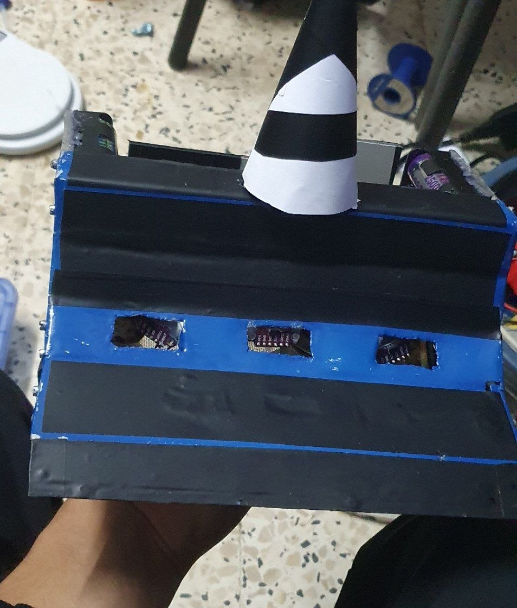
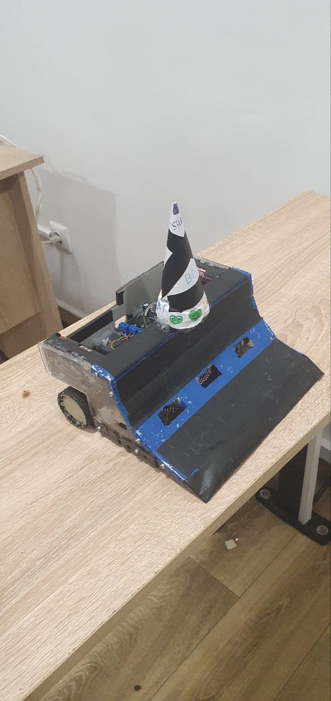
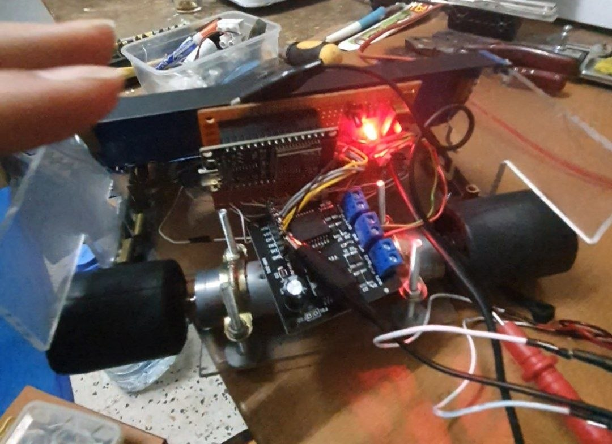
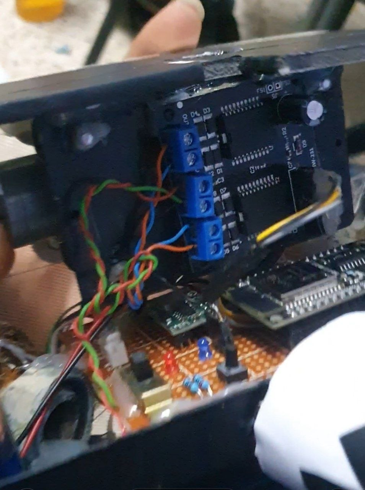
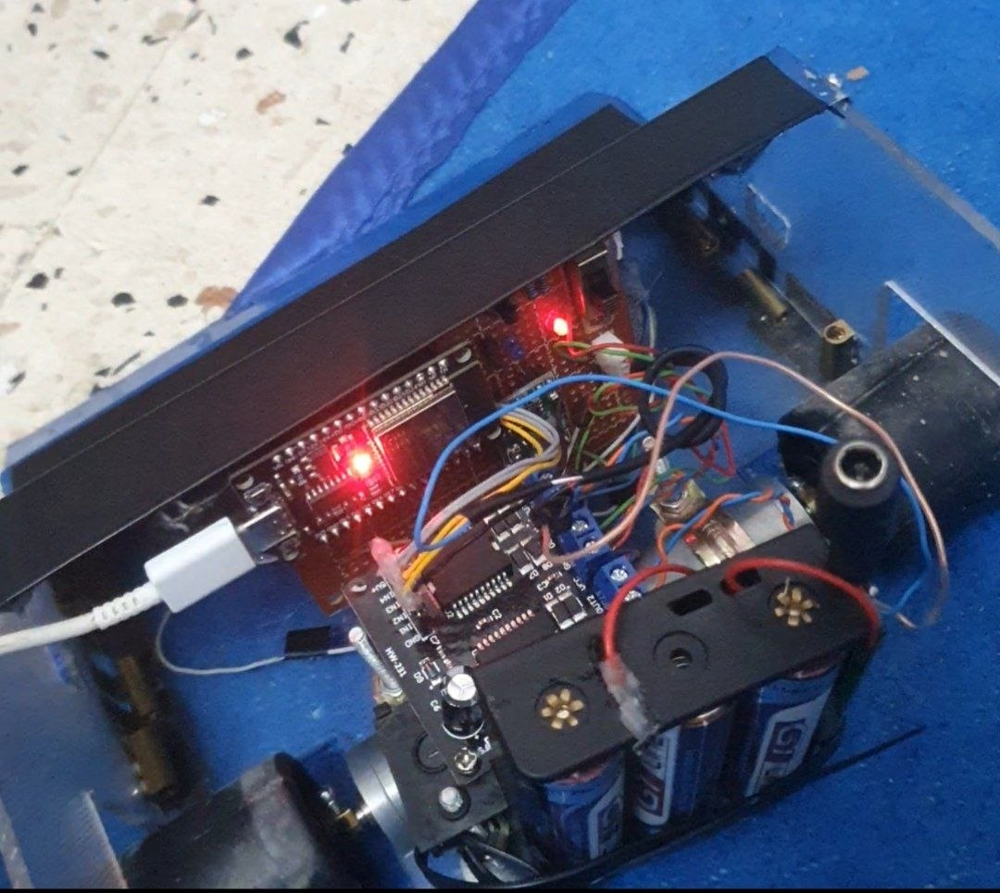

# Mega Sumo Robot v1 with ESP32 and VL53L0X

## Overview
This repository contains the C++ source code and hardware documentation for my Version 1 Mega Sumo Robot. This robot competed in the Mega Sumo category and proudly secured 3rd Place!

Weighing in at 1.4 kg, it is built for raw power and smart tracking, capable of pushing opponents up to 1.9 kg off the dohyo. It uses a combination of Time-of-Flight (ToF) sensors for precise opponent tracking and IR sensors for aggressive line survival.

- **Awards:** 3rd place in a mega sumo robots competition!
- **Sensors:** Three VL53L0X distance sensors (front, left, right), three QRE1113IR line sensors (bottom).
- **Motors:** Two JGA-25 DC motors, driven by an MC33886 dual motor driver.
- **Controller:** ESP32.
- **Weight:** 1.4 kg (pushes up to 1.9 kg).
- **Features:** Advanced line detection and attack logic.

---

## Table of Contents
- [Overview](#overview)
- [Photos](#photos)
- [Hardware List](#hardware-list)
- [Pinout](#pinout)
- [Electrical Schematic](#electrical-schematic)
- [Assembly Instructions](#assembly-instructions)
- [Code](#code)
- [Software Logic & Strategy](#Software-Logic-&-Strategy) 
---

## Photos

> **Add photos here!**
>
> - 

> - 

> - 

---

## Hardware List

| Component              | Quantity | Notes                           |
|------------------------|----------|---------------------------------|
| ESP32 Dev Board        |    1     | Main controller                 |
| VL53L0X ToF Sensor     |    3     | Distance sensing (front array)  |
| QRE1113GR Line Sensor  |    3     | Bottom, line detection          |
| JGA-25 DC Gear Motor   |    2     | Left and right drive            |
| MC33886 Motor Driver   |    1     | Dual channel, motor control     |
| LiPo Battery           |    1     | (match voltage to motor/spec)   |
| Chassis & Wheels       |    1 set | Mechanical assembly             |
| Various wires, PCB     |   as needed |                               |

---

## Pinout

| Function                   | ESP32 Pin  | Description                   |
|----------------------------|------------|-------------------------------|
| VL53L0X Left XSHUT         |    15      | Power/XSHUT left sensor       |
| VL53L0X Center XSHUT       |     2      | Power/XSHUT center sensor     |
| VL53L0X Right XSHUT        |     4      | Power/XSHUT right sensor      |
| VL53L0X SDA                |    21      | I2C Data                      |
| VL53L0X SCL                |    22      | I2C Clock                     |
| QRE1113IR Line Left        |    32      | Detects line (left, bottom)   |
| QRE1113IR Line Center      |    33      | Detects line (center, bottom) |
| QRE1113IR Line Right       |    25      | Detects line (right, bottom)  |
| Motor A IN1 (PWM)          |    12      | MC33886 IN1                   |
| Motor A IN2 (PWM)          |    14      | MC33886 IN2                   |
| Motor B IN1 (PWM)          |    27      | MC33886 IN1                   |
| Motor B IN2 (PWM)          |    26      | MC33886 IN2                   |
| Status LED                 |    13      | Onboard LED                   |

#### VL53L0X I2C Addresses

| Sensor   | I2C Address |
|----------|-------------|
| Left     |   0x30      |
| Center   |   0x39      |
| Right    |   0x32      |

---

## Electrical Schematic


---

## Assembly Instructions


> - 


1. Mount the ESP32 on the chassis.
2. Attach the three VL53L0X sensors: one in the center, and two at each front corner.
3. Fix the three QRE1113IR line sensors underneath the robot (left, center, and right positions).
4. Mount and wire up the MC33886 motor driver to the ESP32 and to both DC motors.
5. Connect battery (ensure proper voltage and protection!).
6. Double-check all wires and sensor orientation.
7. (Optional) Add protective covers for motors/sensors/wires.

---

> - 

## Code

> [FIRMAWRE](src/main_V3.cpp) 
>


```cpp name=src/main.ino
#include <Wire.h>
#include <Adafruit_VL53L0X.h>

// --- Pin Definitions ---
#define SDA_PIN 21
#define SCL_PIN 22
const int LED_PIN = 13;
const int XSHUT_LEFT = 15;
const int XSHUT_CENTER = 2;
const int XSHUT_RIGHT = 4;

#define ADDR_LEFT   0x30
#define ADDR_CENTER 0x39
#define ADDR_RIGHT  0x32

const int M_A_IN1 = 12; 
const int M_A_IN2 = 14; 
const int M_B_IN1 = 27; 
const int M_B_IN2 = 26; 

const int LINE_LEFT   = 32;
const int LINE_CENTER = 33;
const int LINE_RIGHT  = 25;

// ... (remaining code for logic, motor, and sensor control)
```
> [Full code available in `src/FIRMWARE`](src/main_V3.cpp)

---

## Software Logic & Strategy

The code is written in **C++** using the Arduino IDE. It features several advanced control strategies to keep the robot alive and aggressive.

### 1. Distance Filtering (EMA)
Raw Time-of-Flight data can be noisy in a brightly lit competition ring. The code implements an **Exponential Moving Average (EMA)** filter (`ema_alpha = 0.8`) to smooth out the distance readings from the VL53L0X sensors, preventing false attacks.

* **Attack Threshold:** `800 mm` (Center lock-on)
* **Side Threshold:** `570 mm` (Peripheral detection)

### 2. Search Pattern ("Micro Wobble")
When no opponent is detected, the robot enters a **"Micro Wobble"** phase. It drives forward but slightly alternates speed between the left and right motors every `300ms`. This creates a zig-zag sweeping motion, expanding the field of view of the front lasers without losing forward momentum. If nothing is found for `1.8 seconds`, it executes a hard rotational sweep.

### 3. Edge Survival (Line Detection)
The edge detection routine interrupts all other actions immediately. It evaluates 6 distinct scenarios based on which sensors hit the white line:

* **All Sensors / Center Only:** Hard reverse, then spin right.
* **Left Only:** Reverse and spin right to face inward.
* **Right Only:** Reverse and spin left to face inward.

---

